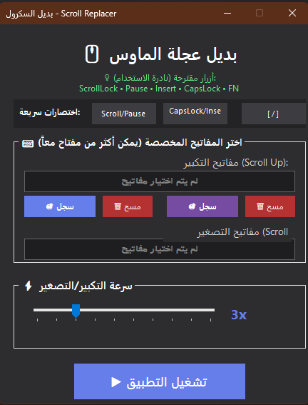
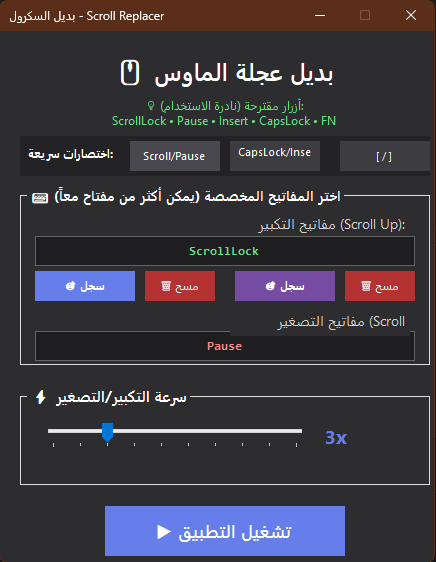

# 🖱️ Scroll Replacer - بديل عجلة الماوس

برنامج يتيح لك استبدال عجلة الماوس بأي مفاتيح تختارها على الكيبورد، مثالي للأشخاص الذين يعانون من مشاكل في عجلة الماوس.

<div dir="rtl">

## 📋 المحتويات
- [نظرة عامة](#نظرة-عامة)
- [المتطلبات](#المتطلبات)
- [التثبيت](#التثبيت)
- [طريقة الاستخدام](#طريقة-الاستخدام)
- [المفاتيح المقترحة](#المفاتيح-المقترحة)
- [بناء المشروع من الكود](#بناء-المشروع-من-الكود)
- [حل المشاكل](#حل-المشاكل)
- [الأسئلة الشائعة](#الأسئلة-الشائلة)

---

## 🎯 نظرة عامة

**Scroll Replacer** هو برنامج مجاني ومفتوح المصدر يسمح لك بـ:
- ✅ استبدال عجلة الماوس التالفة بأزرار الكيبورد
- ✅ استخدام مفتاح واحد أو مجموعة مفاتيح معاً (مثل Ctrl+Shift)
- ✅ التحكم بسرعة التكبير/التصغير (من 1x حتى 10x)
- ✅ العمل في الخلفية دون الحاجة لإبقاء النافذة مفتوحة
- ✅ اختصارات سريعة جاهزة للاستخدام الفوري

---

## 💻 المتطلبات

### لتشغيل البرنامج:
- **نظام التشغيل:** Windows 7 أو أحدث (Windows 10/11 مفضل)
- **.NET Runtime:** .NET 6.0 أو أحدث
  - [تحميل .NET 6.0 Runtime](https://dotnet.microsoft.com/download/dotnet/6.0)

### لبناء المشروع من الكود:
- Visual Studio 2022 أو أحدث
- أو .NET SDK 6.0

---

## 📥 التثبيت

### الطريقة الأولى: استخدام الملف الجاهز
1. حمّل ملف `ScrollReplacer.exe` 
2. شغّل الملف مباشرة (قد يطلب منك Windows تأكيد التشغيل)
3. ابدأ باستخدام البرنامج!

### الطريقة الثانية: بناء المشروع
اتبع التعليمات في قسم [بناء المشروع من الكود](#بناء-المشروع-من-الكود)

---

## 📖 طريقة الاستخدام

### 1️⃣ الإعداد الأولي

عند فتح البرنامج، ستجد واجهة بسيطة تحتوي على:

#### **اختصارات سريعة جاهزة:**
اضغط على أحد الأزرار التالية للإعداد التلقائي:
- **Scroll/Pause**: يستخدم ScrollLock للتكبير و Pause للتصغير
- **CapsLock/Insert**: يستخدم CapsLock للتكبير و Insert للتصغير  
- **[ / ]**: يستخدم الأقواس المربعة

#### **أو اختر المفاتيح يدوياً:**

**لاختيار مفاتيح التكبير (Scroll Up):**
1. اضغط زر "🎯 سجل" في قسم "مفاتيح التكبير"
2. اضغط المفتاح أو المفاتيح التي تريد استخدامها معاً
   - مثال: `Ctrl + Up Arrow` أو `Shift + ScrollLock`
3. اضغط `Enter` للحفظ أو `Esc` للإلغاء

**لاختيار مفاتيح التصغير (Scroll Down):**
1. اضغط زر "🎯 سجل" في قسم "مفاتيح التصغير"
2. اضغط المفاتيح المطلوبة
3. اضغط `Enter` للحفظ

### 2️⃣ ضبط السرعة

استخدم شريط التمرير لتحديد سرعة الحركة:
- **1x**: بطيء جداً (دقيق)
- **3x**: سرعة عادية (افتراضي)
- **10x**: سريع جداً

### 3️⃣ التشغيل

1. اضغط زر "▶️ تشغيل التطبيق"
2. ستظهر رسالة تأكيد تعرض إعداداتك
3. البرنامج الآن يعمل في الخلفية!

### 4️⃣ الوصول للبرنامج أثناء العمل

- **من System Tray (جانب الساعة):**
  - اضغط نقرة مزدوجة على أيقونة البرنامج لإظهار النافذة
  - أو اضغط بالزر الأيمن → "إظهار النافذة"

---

## 🔑 المفاتيح المقترحة

### مجموعات مفاتيح مقترحة:
- `Ctrl + [` و `Ctrl + ]`
- `Alt + -` و `Alt + =`
- `Shift + ScrollLock` و `Shift + Pause`

### ⚠️ تجنب هذه المفاتيح:
- `Ctrl`, `Alt`, `Shift` وحدها (مهمة للاختصارات)
- `Enter`, `Space`, `Backspace` (تُستخدم كثيراً)
- `Arrow Keys` (قد تحتاجها للتنقل)

---

## 🔨 بناء المشروع من الكود

### باستخدام Visual Studio Code:

#### 1️⃣ التحضير الأولي:

**تثبيت المتطلبات:**
- حمّل وثبّت [.NET SDK 6.0](https://dotnet.microsoft.com/download/dotnet/6.0)
- حمّل وثبّت [Visual Studio Code](https://code.visualstudio.com/)
- ثبّت إضافة C# في VS Code:
  - افتح VS Code
  - اذهب إلى Extensions (Ctrl+Shift+X)
  - ابحث عن "C# Dev Kit" وثبّته

#### 2️⃣ فتح المشروع:

1. افتح VS Code
2. اذهب إلى `File` → `Open Folder`
3. اختر مجلد المشروع (المجلد الذي يحتوي على ملفاتك)

#### 3️⃣ بناء المشروع (3 طرق):

**الطريقة الأولى: من Terminal داخل VS Code**

1. افتح Terminal في VS Code:
   - اضغط `Ctrl + ` ` (زر التلدة)
   - أو من القائمة: `Terminal` → `New Terminal`

2. نفذ أحد الأوامر التالية:

**نسخة مستقلة (لا تحتاج .NET Runtime) - مُوصى بها:**
```bash
dotnet publish -c Release -r win-x64 --self-contained true -p:PublishSingleFile=true
```

**نسخة خفيفة (تحتاج .NET Runtime):**
```bash
dotnet publish -c Release -r win-x64 --self-contained false -p:PublishSingleFile=true
```

**نسخة بسيطة للتجربة:**
```bash
dotnet build -c Release
```

3. **مكان الملف:**
   - نسخة مستقلة: `bin\Release\net6.0-windows\win-x64\publish\ScrollReplacer.exe`
   - نسخة بسيطة: `bin\Release\net6.0-windows\ScrollReplacer.exe`

**الطريقة الثانية: استخدام Build Task**

1. اضغط `Ctrl + Shift + B`
2. اختر `.NET: build`
3. الملف سيكون في: `bin\Release\net6.0-windows\`

**الطريقة الثالثة: إنشاء ملف Build Script**

أنشئ ملف اسمه `build.bat` في مجلد المشروع:
```batch
@echo off
echo Building ScrollReplacer...
dotnet publish -c Release -r win-x64 --self-contained true -p:PublishSingleFile=true
echo.
echo Done! File location:
echo bin\Release\net6.0-windows\win-x64\publish\ScrollReplacer.exe
pause
```

ثم شغّل الملف بنقرة مزدوجة!

#### 4️⃣ التأكد من نجاح البناء:

ستشاهد رسالة مثل:
```
Build succeeded.
    0 Warning(s)
    0 Error(s)
```

---

### باستخدام Visual Studio (إذا كان متوفراً):

1. **افتح المشروع:**
   ```
   افتح ملف ScrollReplacer.sln في Visual Studio
   ```

2. **تغيير وضع البناء:**
   - في الشريط العلوي، غيّر من `Debug` إلى `Release`

3. **بناء المشروع:**
   - اذهب إلى `Build` → `Build Solution`
   - أو اضغط `Ctrl + Shift + B`

4. **مكان الملف:**
   ```
   ScrollReplacer\bin\Release\net6.0-windows\ScrollReplacer.exe
   ```

---

### باستخدام سطر الأوامر (خارج VS Code):

#### نسخة مستقلة (لا تحتاج .NET Runtime):
```bash
dotnet publish -c Release -r win-x64 --self-contained true -p:PublishSingleFile=true
```

**مكان الملف:**
```
bin\Release\net6.0-windows\win-x64\publish\ScrollReplacer.exe
```

#### نسخة خفيفة (تحتاج .NET Runtime):
```bash
dotnet publish -c Release -r win-x64 --self-contained false -p:PublishSingleFile=true
```

**الحجم:** أصغر بكثير (~200 KB) لكن تحتاج .NET 6.0 مثبت

### خيارات إضافية:

**لنظام 32-bit:**
```bash
dotnet publish -c Release -r win-x86 --self-contained true -p:PublishSingleFile=true
```

**لتقليل حجم الملف:**
```bash
dotnet publish -c Release -r win-x64 --self-contained true -p:PublishSingleFile=true -p:PublishTrimmed=true
```

---

## 🔧 حل المشاكل

### المشكلة: البرنامج لا يعمل بعد الضغط على "تشغيل"

**الحل:**
1. تأكد من اختيار مفاتيح للتكبير أو التصغير (أو كليهما)
2. أعد تشغيل البرنامج بصلاحيات المسؤول:
   - اضغط بالزر الأيمن على الملف
   - اختر "Run as administrator"

### المشكلة: المفاتيح لا تستجيب

**الحل:**
1. تأكد أن البرنامج يعمل (تحقق من أيقونة System Tray)
2. جرّب مفاتيح مختلفة
3. تأكد من عدم وجود برنامج آخر يستخدم نفس المفاتيح

### المشكلة: "Missing .NET Runtime"

**الحل:**
- حمّل وثبّت [.NET 6.0 Runtime](https://dotnet.microsoft.com/download/dotnet/6.0)
- أو استخدم النسخة المستقلة (self-contained) من البرنامج

### المشكلة: Windows يحذر من الملف

**الحل:**
- هذا طبيعي للبرامج التي لا تحمل شهادة رقمية
- اضغط "More info" ثم "Run anyway"
- البرنامج آمن 100% ومفتوح المصدر

### المشكلة: البرنامج يتوقف عند إغلاق النافذة

**الحل:**
- لا تغلق النافذة، فقط صغّرها
- البرنامج سيستمر بالعمل في System Tray

---

## ❓ الأسئلة الشائعة

### س: هل يمكنني استخدام مجموعة من 3 مفاتيح أو أكثر؟
**ج:** نعم! البرنامج يدعم أي عدد من المفاتيح. مثلاً: `Ctrl + Shift + Up`

### س: هل يؤثر البرنامج على أداء الجهاز؟
**ج:** لا، البرنامج خفيف جداً ولا يستهلك موارد ملحوظة.

### س: هل يعمل البرنامج مع الألعاب؟
**ج:** نعم، يعمل مع معظم التطبيقات والألعاب، لكن بعض الألعاب قد تحتاج تشغيل البرنامج بصلاحيات المسؤول.

### س: هل البرنامج يسجل ضغطات المفاتيح؟
**ج:** لا، البرنامج يراقب فقط المفاتيح التي اخترتها ولا يسجل أي شيء.

### س: كيف أوقف البرنامج؟
**ج:** اضغط بالزر الأيمن على أيقونة البرنامج في System Tray → "إيقاف"

### س: هل يمكنني تغيير المفاتيح أثناء عمل البرنامج؟
**ج:** نعم، افتح النافذة، غيّر المفاتيح، واضغط "تشغيل" مرة أخرى.

---

## 📝 ملاحظات تقنية

### بنية المشروع:
```
ScrollReplacer/
├── Program.cs              # نقطة دخول البرنامج
├── Form1.cs                # الواجهة الرئيسية والمنطق
├── Form1.Designer.cs       # تصميم النموذج
├── ScrollReplacer.csproj   # ملف المشروع
└── ScrollReplacer.sln      # ملف الحل
```

### التقنيات المستخدمة:
- **Windows Forms** للواجهة الرسومية
- **Windows API (user32.dll)** للتحكم بالماوس والكيبورد
- **Low-Level Keyboard Hook** لمراقبة المفاتيح عالمياً
- **.NET 6.0** كإطار عمل

### الصلاحيات المطلوبة:
- البرنامج يحتاج صلاحيات عادية للعمل
- لكن قد يحتاج صلاحيات المسؤول للعمل مع بعض البرامج المحمية

---

## 🤝 المساهمة

هذا المشروع مفتوح المصدر! يمكنك:
- الإبلاغ عن المشاكل (Issues)
- اقتراح ميزات جديدة
- المساهمة في تطوير الكود

---

## 📄 الترخيص

هذا البرنامج مجاني ومفتوح المصدر للاستخدام الشخصي والتجاري.

---

## 🌟 نصائح للاستخدام الأمثل

1. **اختر مفاتيح نادرة:** استخدم ScrollLock أو Pause لأنها نادراً ما تُستخدم
2. **جرب السرعات:** ابدأ بالسرعة 3x ثم عدّلها حسب راحتك
3. **صلاحيات المسؤول:** إذا لم يعمل مع برنامج معين، جرّب تشغيله كـ Administrator
4. **التشغيل التلقائي:** يمكنك إضافة البرنامج لمجلد Startup ليعمل تلقائياً عند بدء Windows

---


## 📸 صور البرنامج

### الواجهة الرئيسية


### تسجيل المفاتيح


---

<div align="center">

**استمتع باستخدام Scroll Replacer! 🎉**

إذا أعجبك البرنامج، لا تنسَ مشاركته مع أصدقائك! ⭐

</div>

</div>
